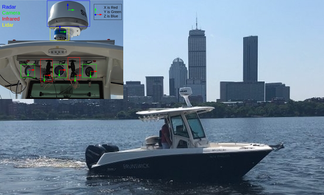

# Principles of Automatic Control
> This is a course on principles of automatic control using classical control theory. The course uses Python to implement some of the concepts described in class.

<table style='margin: 0 auto' rules=none>
    <tr>
    <td>  </td>        
    <td>  </td>    
    </tr>
</table>

<table style='margin: 0 auto' rules=none>
    <tr>    
    <td>  </td>
    </tr>
</table>

## Install

The notebooks run with python 3.9 and use the following python libraries:
- sympy
- python control
- numpy
- pandas
- matplotlib 
- opencv-python

Notebook `01_Getting_started_with_Python_and_Jupyter_Notebook.ipynb` provides a short introduction on how to set up an anaconda environment to get you started.

## How to use

Each notebook is thought to be independent from every other, so it is possible to run them in any order you prefer.

## Acknowledgements and references
- Images above are from the paper _Conlan Cesar, Benjamin Whetton, Michael DeFilippo, Michael Benjamin, Michael Sacarny, Scott Reed, Andrea Munafo, Coordinating Multiple Autonomies to Improve Mission Performance, OCEANS 2021 MTS/IEEE, October, 2021_

- _Some of the images and content used in the notebooks have been based on resources available from [engineeringmedia.com](https://engineeringmedia.com/map-of-control). The website and the youtube videos are a fantastic resource on control systems._

- The pendulum example is inspired by [Control tutorials for Matlab and Simulink](hhttps://ctms.engin.umich.edu/CTMS/index.php?aux=Activities_Pendulum)

- Relevant textbooks used to prepare these notebooks are reported in `00_Syllabus.ipynb`. 

## Additional resources

- [Control systems academy](http://www.controlsystemsacademy.com/)
- [Process Dynamics and Control in Python](https://apmonitor.com/pdc/index.php)
- [Karl J. Åström and Richard M. Murray, Feedback Systems: An Introduction for Scientists and Engineers](http://www.cds.caltech.edu/~murray/amwiki/index.php/Main_Page)
- [Lecture series on Control Engineering by Prof. Madan Gopal](https://www.youtube.com/playlist?list=PLghJObT_RyfLmKRT86TquJhG6QuiHZ6Pi)
- [Designing Lead and Lag Compensators in Matlab and Simulink](https://ctms.engin.umich.edu/CTMS/index.php?aux=Extras_Leadlag)

--------------------
